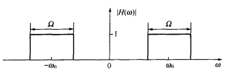

# 2 #

## 2.1 ##

利用重复抛掷一枚硬币的试验，定义一随机过程为

$$ X(t) = \left\{
\begin{matrix}
\cos\pi t, 出现反面\\
2t, 出现正面
\end{matrix}
\right. $$
假设出现正面或反面的概率各为 1/2 。

(1) 确定 $X(t)$ 的一维分布函数 $F_1(x, \dfrac{1}{2}), F_1(x, 1)$

$$ F(x, t) = P\{X(t) < x\} = \dfrac{P\{2t < x\} + P\{\cos\pi t < x\}}{2} $$
$$ = \dfrac{P\{x > \max\{2t, \cos\pi t\}\} + P\{x > \min\{2t, \cos\pi t\}\}}{2}
$$
$$ = \dfrac{1}{2}u(x - \max\{2t, \cos\pi t\}) + \dfrac{1}{2}u(x - \min\{2t,
\cos\pi t\}) $$
$$ F(x, \dfrac{1}{2}) = \dfrac{1}{2}u(x - 1) + \dfrac{1}{2}u(x) $$
$$ F(x, 1) = \dfrac{1}{2}u(x - 2) + \dfrac{1}{2}u(x + 1) $$

(2) 确定 X(t) 的二维分布函数 $F(x_1, x_2; \dfrac{1}{2}, 1)$ 。

$$ F(x_1, x_2; t_1, t_2) = P\{X(t_1) < x_1\}\cup\{X(t_2) < x_2\} $$
$$ = P\{X(t_1) < x_1\}P\{X(t_2) < x_2\} = F(x_1, t_1)F(x_2, t_2) $$
$$ F(x_1, x_2; \dfrac{1}{2}, 1) = \big(\dfrac{1}{2}u(x_1 - 1) +
\dfrac{1}{2}u(x_1)\big)\big(\dfrac{1}{2}u(x_2 - 2) + \dfrac{1}{2}u(x_2 + 1)\big)
$$
$$ = \dfrac{u(x_1 - 1)u(x_2 - 2) + u(x_1 - 1)u(x_2 + 1) + u(x_1)u(x_2 - 2) +
u(x_1)u(x_2 + 1)}{4} $$

## 2.3 ##

设有随机信号 $X(t) = A\cos\omega t$，其中 $\omega$ 为常量， $A$ 在区间 (0，1) 上
均匀分布的随机变量。试求时刻 $t = 0, \dfrac{\pi}{4\omega}, \dfrac{\pi}{2\omega}$
时 $X(t)$ 的一维概率密度。

$$ a(x) = \dfrac{x}{\cos\omega t} $$
$$ f(x, t) = f_A\bigl(a(x)\bigr) \left|\dfrac{d}{dx}a(x)\right| =
\dfrac{u(x) - u(x - \frac{x}{\cos\omega t})}{\left|\cos\omega t\right|} $$
$$ P(x, 0) = u(x) - u(x - 1) $$
$$ P(x, 0) = \sqrt{2}\bigl(u(x) - u(x - \frac{x}{\cos\omega t})\bigr) $$
$$ P(x, 0) = u(x^-) - u(x^+) $$
$$ = \left\{
\begin{matrix}
1, x = 0\\
0, x \neq 0
\end{matrix}
\right. $$

## 2.5 ##

给定随机过程 $X(t) = A\cos\omega t + B\sin\omega t$ ，式中 $\omega$ 为常数， $A$
和 $B$ 是统计独立的标准正态随机变量。试求 $X(t)$ 的均值、方益、相关函数、协方差
函数、均方值、标准差。

$$ EX(t) = E(A\cos\omega t + B\cos\omega t) = \cos\omega tEA + \sin\omega tEB =
0 $$
$$ DX(t) = D(A\cos\omega t + B\cos\omega t) = \cos^2\omega tDA + \sin^2\omega
tDB = 1 $$
$$ R_X(t_1, t_2) = E\bigl(X(t_1)X(t_2)\bigr) = \cos\omega t_1\cos\omega t_2EA^2
+ \sin\omega t_1\sin\omega t_2EB^2 = \cos\omega(t_1 - t_2) $$
$$ C_X(t_1, t_2) = E\bigl(X(t_1)X(t_2)\bigr) - EX(t_1)EX(t_2) = E\bigl(X(t_1)X(t_2)\bigr) $$
$$ = \cos\omega(t_1 - t_2) $$
$$ EX^2(t) = R_X(t, t) = \cos\omega(t - t) = 1 $$
$$ \sqrt{DX(t)} = 1 $$

## 2.10 ##

随机过程 $X(t) = X\cos(\omega t + \theta)$ ，式中 $\omega$ 为常数， $X$ 服从正态
分布 $N(0, \sigma^2)$ ， $\theta$ 在 $(0, 2\pi)$ 上均匀分布，且 $X$ 与 $\theta$
统计独立。
(1) 求 $X(t)$ 的数学期望、方差和相关函数；

$$ X, \theta 统计独立 \rightarrow X, \cos(\omega t + \theta) 统计独立 $$
$$ EX(t) = E(X)E\cos(\omega t + \theta) = 0 $$
$$ DX(t) = DXD\cos(\omega t + \theta) = \sigma^2E\cos^2(\omega t + \theta) $$
$$ = \sigma^2E\left(\dfrac{1 + \cos 2(\omega t + \theta)}{2}\right) $$
$$ = \dfrac{\sigma^2}{2} $$
$$ R_X(t_1, t_2) = E\bigl(X(t_1)X(t_2)\bigr) = EX^2E\bigl(\cos(\omega t_1 +
\theta)\cos(\omega t_2 + \theta)\bigr) $$
$$ = \dfrac{1}{2}EX^2E\bigl(\cos(\omega t_1 + \omega t_2 + 2\theta) + \cos(\omega t_1 - \omega t_2)\bigr) $$
$$ = \dfrac{EX^2}{2}\bigl(E\cos(\omega t_1 + \omega t_2 + 2\theta) +
E\cos(\omega t_1 - \omega t_2)\bigr) $$
$$ = \dfrac{EX^2E\cos(\omega t_1 - \omega t_2)}{2} =
\dfrac{\sigma^2}{2}\cos(\omega t_1 - \omega t_2) $$

(2) 问 $X(t)$ 是否平稳?

$$ R_X(t_1 - t_2) = \dfrac{\sigma^2}{2}\cos\omega(t_1 - t_2) \rightarrow X(t) 平
稳 $$

## 2.11 ##

设 $s(t)$ 是周期为 $T$ 的函数， $\theta$ 是在 $(0，T)$ 上均匀分布的随机变量，试
证明周期性随机初相过程 $X(t) = s(t + \theta)$ 为各态历经过程。

$$ \mu_X = EX(t) = \dfrac{1}{T}\int\nolimits_0^T s(t + \theta)d\theta $$
$$ <x(t)> = \lim_{T' \rightarrow \infty}\int\nolimits_{0}^{T'} x(t)dt \\
= \lim_{N \rightarrow \infty}\dfrac{1}{NT}\int\nolimits_0^{NT} x(t)dt \\
= \dfrac{1}{T}\int\nolimits_0^T s(t + \theta)dt $$
$$ \mu_X = <x(t)> \rightarrow X(t) 均值各态历经 $$
$$ R_X(\tau) = E\bigl(X(t)X(t + \tau)\bigr) = \dfrac{1}{T}\int\nolimits_0^T s(t
+ \theta)s(t + \tau + \theta)d\theta $$
$$ <x(t)x(t + \tau)> = \lim_{T' \rightarrow \infty}\dfrac{1}{T'}\int\nolimits_0^{T'} x(t)x(t
+ \tau)dt \\
= \lim_{N \rightarrow \infty}\dfrac{1}{NT}\int\nolimits_0^{NT} s(t + \theta)s(t + \tau + \theta)dt \\
= \dfrac{1}{T}\int\nolimits_0^T s(t + \theta)s(t + \theta + \tau)dt $$
$$ R_X(\tau) = <x(t)x(t + \tau)> \rightarrow X(t) 自相关各态历经 $$

下面这2表达式我实在算不出来。
$$ \lim_{T' \rightarrow \infty}\dfrac{1}{T'}\int\nolimits_{0}^{T'} \left(1 -
\dfrac{\tau}{T'}\right)\bigl(R_X(\tau) - \mu_X^2\bigr)d\tau $$
$$ \lim_{T' \rightarrow \infty}\dfrac{1}{T'}\int\nolimits_{0}^{T'} \left(1 -
\dfrac{\tau}{T'}\right)\bigl(B_X(\tau, t) - R_X^2(t)\bigr)d\tau $$

## 2.12 ##

已知平稳随机过程 $X(t)$ 的相关函数为 $R_X(\tau) = \sigma^2\mathrm{e}^{ - a |
\tau | }\cos\beta\tau$ 。

(1) 求功率谱密度 $G_X(\omega), F_X(\omega)$ 和 $F_X(f)$

$$ G_X(\omega) = \int\nolimits_{-\infty}^\infty R_X(\tau)\mathrm{e}^{ -
\jmath\omega\tau}d\tau = \Re\int\nolimits_{-\infty}^\infty \sigma^2\mathrm{e}^{ - a
| \tau | - \jmath\omega\tau + \jmath\beta\tau }d\tau $$
$$ = \Re\int\nolimits_0^\infty \sigma^2\mathrm{e}^{ - (a + \jmath\omega -
\jmath\beta)\tau }d\tau
+ \Re\int\nolimits_{-\infty}^0 \sigma^2\mathrm{e}^{(a - \jmath\omega +
\jmath\beta)\tau }d\tau $$
$$ = \Re\sigma^2( - \left.\dfrac{\mathrm{e}^{ - (a + \jmath\omega -
\jmath\beta)\tau}}{a + \jmath\omega - \jmath\beta}\right|_0^\infty +
\left.\dfrac{\mathrm{e}^{(a - \jmath\omega + \jmath\beta)\tau}}{a - \jmath\omega
+ \jmath\beta}\right|_{ - \infty }^0) $$
$$ = \Re\sigma^2(\dfrac{1}{a + \jmath\omega - \jmath\beta} + \dfrac{1}{a -
\jmath\omega + \jmath\beta}) $$
$$ = \dfrac{a\sigma^2}{a^2 + (\omega + \beta)^2} + \dfrac{a\sigma^2}{a^2 + (\omega - \beta)^2} $$

$$ F_X(\omega) = 2G_X(\omega)u(\omega) $$
$$ = \dfrac{2a\sigma^2u(\omega)}{a^2 + (\omega + \beta)^2} +
\dfrac{2a\sigma^2u(\omega)}{a^2 + (\omega - \beta)^2} $$

$$ \tilde{F}_X(f) = F_X(2\pi f) $$
$$ = \dfrac{2a\sigma^2u(f)}{a^2 + (2\pi f + \beta)^2} +
\dfrac{2a\sigma^2u(f)}{a^2 + (2\pi f - \beta)^2} $$

(2) 求相关系数 $r_X(\tau)$ 和相关时间 $\tau_0$ 。

$$ r_X(\tau) = \dfrac{R_X(\tau) - R_X(\infty)}{\sigma_X^2} $$
$$ = \mathrm{e}^{ - a|x|}\cos\beta\tau $$
$$ \tau_0 = \int\nolimits_{0}^\infty r_X(\tau)d\tau = \dfrac{a}{a^2 + \beta^2}
$$

## 2.21 ##

已知随机过程 $Y(t) = X(t) + s(t)$ ，式中 $s(t) = \cos(\omega_0t + \theta)$ ，
$\omega_0$ 为常数， $X(t)$ 为零均值平稳正态过程，且与 $s(t)$ 统计独立。问当
$\theta$ 分别在下列两种情况:

随机过程 $Y(t)$ 是否为正态分布，是否平稳?

(1) $\theta$ 为随机变量，且在 $(0, 2\pi)$ 上均匀分布;

$$ f_\theta(\theta) = \dfrac{u(\theta) - u(\theta - 2\pi)}{2\pi} $$
$$ \theta_1(s) = \arccos(s) - \omega_0t $$
$$ \theta_2(s) = 2\pi - \arccos(s) + \omega_0t $$
$$ s\in[0, 1] $$
$$ f_s(s) = \sum_{i = 0}^1
f_\theta(\theta_i(s))\left|\dfrac{d}{ds}\theta_i(s)\right| $$
$$ = \dfrac{f_\theta\bigl(\theta_2(s)\bigr) +
f_\theta\bigl(\theta_1(s)\bigr)}{\sqrt{1 - s^2}} $$
$$ = \dfrac{u(\theta_2) - u(\theta_2 - 2\pi) + u(\theta_1) - u(\theta_1 -
2\pi)}{2\pi\sqrt{1 - s^2}} $$
$$ = \dfrac{u(\theta_2) - u( - \theta_2) + u(\theta_1) - u( -
\theta_1)}{2\pi\sqrt{1 - s^2}} $$
$$ = \dfrac{\mathrm{sgn}(\theta_2) + \mathrm{sgn}(2\pi - \theta_2)}{2\pi\sqrt{1 - s^2}}
$$
$$ = \dfrac{u(\theta_2) - u(\theta_2 - 2\pi)}{2\pi\sqrt{1 - s^2}} $$
$$ = \dfrac{u(s) - u(s - 1)}{2\pi\sqrt{1 - s^2}} $$
$$ s(t)\nsim N \rightarrow Y(t)\nsim N $$
$$ EY(t) = EX(t) + Es(t) = 0 $$
$$ R_Y(t, t + \tau) = E\bigl(Y(t)Y(t + \tau)\bigr) $$
$$ = R_X(\tau) + E\Bigl(\cos(\omega_0t + \theta)\cos\bigl(\omega_0(t + \tau) +
\theta\bigr)\Bigr) $$
$$ = R_X(\tau) + \dfrac{1}{2}E\Bigl(\cos(2\omega_0t + \omega_0\tau +
\theta) + \cos\bigl(\omega_0\tau\bigr)\Bigr) $$
$$ = R_X(\tau) + \dfrac{\cos\omega_0\tau}{2} $$
$$ \rightarrow Y(t)平稳 $$

(2) $\theta = 0$ 。

$$ Y(t) - \cos\omega_0t\sim N(0, \sigma^2) $$
$$ Y(t)\sim N(\cos\omega_0t, \sigma^2) $$
$$ EY(t) = \cos\omega_0t \rightarrow Y(t)非平稳 $$

## 2.26 ##

设随机过程 $Y(t) = \int\nolimits_{-\infty}^t X(\tau)d\tau$ ，已知输入随机过程
$X(t)$ 的功率谱密度 $G_X(t)$， 试求 $Y(t)$ 的功率谱密度 $G_Y(\omega)$

$$ Y(t) = X(t) * u(t) $$
$$ U(\omega) = \mathscr{F}u(t) = \dfrac{1}{\jmath\omega} + \pi\delta(\omega) $$
$$ G_Y(\omega) = G_X(\omega)\dfrac{1 + \pi^2\omega^2\delta^2(\omega)}{\omega^2}
$$

## 2.32 ##

设白噪声的相关函数为 $\dfrac{N_0}{2}\delta(\tau)$ ，通过幅频特性如图1所示的理想
带通放大器，求放大器输出的总噪声功率。

$$ H(\omega) = u\left(|\omega| - \omega_0 + \dfrac{\Omega}{2}\right) -
u\left(|\omega| - \omega_0 - \dfrac{\Omega}{2}\right) $$
$$ G_X(\omega) = \int\nolimits_{-\infty}^\infty R_X(\tau)\mathrm{e}^{ -
\jmath\omega\tau}d\tau = \dfrac{N_0}{2} $$
$$ G_Y(\omega) = G_X(\omega)H^2(\omega) = \dfrac{N_0}{2}u\left(|\omega| -
\omega_0 + \dfrac{\Omega}{2}\right) - \dfrac{N_0}{2}u\left(|\omega| - \omega_0 -
\dfrac{\Omega}{2}\right) $$

## 2.34 ##

功率谱密度为 $\dfrac{N_0}{2}$ 的平稳高斯白噪声通过一滤波器，其传输函数
$H(\omega) = \dfrac{1}{1 + \jmath\omega/\omega_0}$ ，试求输出噪声的一维概率密度
。

$$ X(t) \sim N \& H(\omega) \in \mathrm{LTI} \rightarrow Y(t) \sim N $$
$$ G_Y(\omega) = G_X(\omega)|H(\omega)|^2 = \dfrac{N_0}{2}\dfrac{1}{1 + (\omega/\omega_0)^2} $$
$$ R_Y(\tau) = \dfrac{N_0\omega_0}{4}\mathrm{e}^{ - \omega_0|\tau|} $$
$$ EY(t) = R_Y(\infty) = 0 $$
$$ DY(t) = R_Y(0) - R_Y(\infty) = \dfrac{N_0\omega_0}{4} $$
$$ f_Y(y) = \dfrac{1}{\sqrt{2\pi\dfrac{N_0\omega_0}{4}}}\mathrm{e}^{ -
y^2/\left(2\frac{N_0\omega_0}{4}\right)} $$
$$ = \sqrt{\dfrac{2}{\pi N_0\omega_0}}\mathrm{e}^{ - 2y^2/(N_0w_0)} $$

